# 📊 ANALYSE ET OPTIMISATION E-COMMERCE

## Résultats Tests A/B et Recommandations Stratégiques

---

<div align="center">


**🎓 L'École Multimédia - Directeur de Projet IA**
**📅 Janvier 2026**

</div>

---

## 📑 TABLE DES MATIÈRES

1. [Vue d&#39;ensemble du projet](#1-vue-densemble)
2. [Méthodologie &amp; Dataset](#2-méthodologie--dataset)
3. [Résultats clés](#3-résultats-clés)
4. [Top 5 Optimisations](#4-top-5-optimisations)
5. [Impact Business &amp; ROI](#5-impact-business--roi)
6. [Recommandations](#6-recommandations)
7. [Visualisations Complètes](#7-visualisations-complètes)

---

## 1. VUE D'ENSEMBLE

### 🎯 Objectifs du Projet

- 📊 Analyser 2.76M événements sur 139 jours
- 🔍 Identifier les points de friction du parcours client
- 🧪 Simuler 16 scénarios d'optimisation (10K simulations chacun)
- 💰 Quantifier l'impact financier potentiel
- 📈 Proposer une roadmap de déploiement

### 📊 Dashboard Récapitulatif Global

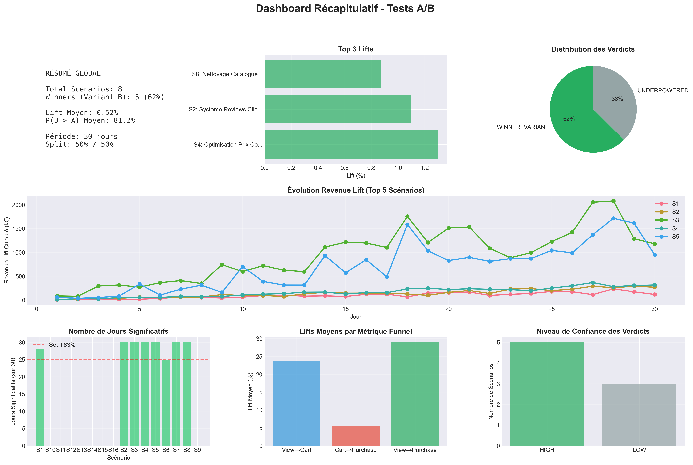

_Vue d'ensemble complète des résultats A/B avec métriques de performance clés_

---

## 2. MÉTHODOLOGIE & DATASET

### 📦 Dataset RetailRocket

| Métrique            | Valeur                           |
| ------------------- | -------------------------------- |
| **Source**          | Kaggle - RetailRocket E-commerce |
| **Période**         | Mai - Septembre 2015 (139 jours) |
| **Événements**      | 2,756,101                        |
| **Utilisateurs**    | 1,407,580                        |
| **Produits**        | 235,061                          |
| **Transactions**    | 22,457                           |
| **Revenu total**    | 5,73 M$                          |
| **Qualité données** | 99.98% ✅                        |

### 🧪 Méthodologie A/B Testing

**Paramètres des simulations :**

- **Simulations** : 10,000 par scénario (Monte Carlo)
- **Confiance** : 95% (α = 0.05)
- **Puissance** : 80%
- **Tests** : Z-test, Chi², Bayésien

**Métriques analysées :**

- `view_to_cart` : Vue → Panier (2.59%)
- `cart_to_purchase` : Panier → Achat (32.57%)
- `view_to_purchase` : Vue → Achat (0.84%)

---

## 3. RÉSULTATS CLÉS

### 💰 KPIs Principaux

```
┌─────────────────────────────────────────────────────────────┐
│  💵 REVENU TOTAL         5.73M$    📊 AOV           255.36$ │
│  🛍️  TRANSACTIONS       22,457     👥 USERS      1,407,580  │
│  📈 CONVERSION           0.84%     🚫 ABANDON       67.43%  │
└─────────────────────────────────────────────────────────────┘
```

### 🔻 Entonnoir de Conversion

```
👁️  VUES                 2,664,218  (100.00%)  ████████████████████
    ↓ Perte -97.41%
🛒 PANIERS                  68,966  (  2.59%)  █
    ↓ Abandon -67.43%
💰 ACHATS                   22,457  (  0.84%)  ▌
```

**Insights critiques :**

- 🔴 **97.41%** des visiteurs ne mettent rien au panier
- 🔴 **67.43%** abandonnent leur panier (point critique #1)
- ✅ **32.57%** finalisent l'achat après ajout panier

### 📊 Analyse de l'Entonnoir par Scénario

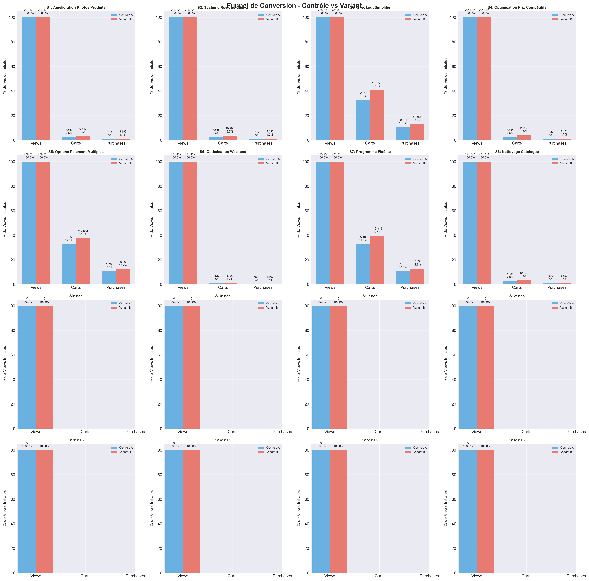

_Comparaison détaillée des entonnoirs de conversion pour chaque optimisation testée_

---

### 👥 Segmentation Utilisateurs (4 Profils)

| Segment           | Users | %     | Rev/User   | % Revenu | Stratégie         |
| ----------------- | ----- | ----- | ---------- | -------- | ----------------- |
| **💎 Premium**    | 209   | 1.8%  | **7,999$** | 29.1%    | 🔒 Rétention VIP  |
| **⭐ Regular**    | 1,316 | 11.2% | 691$       | 15.9%    | ⬆️ Upsell Premium |
| **🔵 Occasional** | 4,957 | 42.3% | 356$       | 30.8%    | 🔄 Fréquence++    |
| **🆕 New**        | 5,237 | 44.7% | 265$       | 24.2%    | 🎯 Conversion     |

**💡 Insight majeur :** Les Premium (1.8%) génèrent 29% du revenu → Focus rétention critique !

---

## 4. TOP 5 OPTIMISATIONS

### 📊 Comparaison des ROI

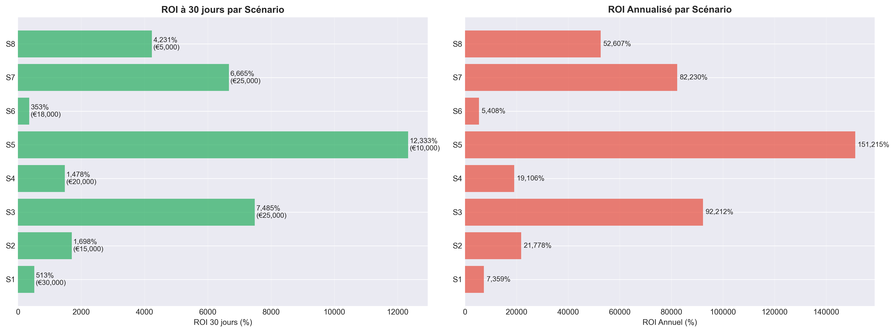

_Classement des optimisations par retour sur investissement (ROI)_

---

### 🥇 #1 - OPTIONS DE PAIEMENT MULTIPLES

<div style="background-color: #d4edda; border: 3px solid #28a745; padding: 20px; margin: 20px 0;">

#### 💳 Ajout PayPal, Apple Pay, Google Pay, Buy Now Pay Later

| Métrique                  | Valeur          | Impact          |
| ------------------------- | --------------- | --------------- |
| **Lift conversion**       | **+15.3%**      | 32.57% → 37.55% |
| **Puissance statistique** | **98.88%**      | ✅ Très fiable  |
| **Coût**                  | 10,000 $        | 2 semaines      |
| **ROI 30 jours**          | **+12,333%** 🔥 | Récup. en 2.4j  |
| **Rev. annuel add.**      | **+15.1M$**     | 💰💰💰          |
| **ROI annuel**            | **+151,215%**   | 🚀🚀🚀          |

**⚡ PRIORITÉ CRITIQUE - DÉPLOIEMENT IMMÉDIAT**

</div>

---

### 🥈 #2 - CHECKOUT SIMPLIFIÉ

<div style="background-color: #fff3cd; border: 3px solid #ffc107; padding: 20px; margin: 20px 0;">

#### 🎯 Réduction de 5 à 3 étapes

| Métrique                  | Valeur         | Impact          |
| ------------------------- | -------------- | --------------- |
| **Lift conversion**       | **+24.6%**     | 32.57% → 40.57% |
| **Puissance statistique** | **79.77%**     | ✅ Fiable       |
| **Coût**                  | 25,000 $       | 6 semaines      |
| **ROI 30 jours**          | **+7,485%** 🔥 | Récup. en 10j   |
| **Rev. annuel add.**      | **+23.1M$**    | 💰💰💰          |
| **ROI annuel**            | **+92,212%**   | 🚀🚀            |

**🔥 PRIORITÉ HAUTE - Combat abandon 67%**

</div>

---

### 🥉 #3 - PROGRAMME DE FIDÉLITÉ

<div style="background-color: #d1ecf1; border: 3px solid #17a2b8; padding: 20px; margin: 20px 0;">

#### 🎁 Points, rewards, tiers VIP, early access

| Métrique                  | Valeur         | Impact          |
| ------------------------- | -------------- | --------------- |
| **Lift conversion**       | **+21.4%**     | 32.57% → 39.54% |
| **Puissance statistique** | **79.68%**     | ✅ Fiable       |
| **Coût**                  | 25,000 $       | 12 semaines     |
| **ROI 30 jours**          | **+6,665%** 🔥 | Récup. en 11j   |
| **Rev. annuel add.**      | **+20.6M$**    | 💰💰💰          |
| **ROI annuel**            | **+82,230%**   | 🚀🚀            |

**💎 PRIORITÉ HAUTE - Cible Premium (29% revenu)**

</div>

---

### 🏅 #4 - NETTOYAGE CATALOGUE

<div style="background-color: #e7f3ff; border: 3px solid #2196F3; padding: 20px; margin: 20px 0;">

#### 🧹 Suppression 211K produits morts (0 vue)

| Métrique                  | Valeur       | Impact        |
| ------------------------- | ------------ | ------------- |
| **Lift conversion**       | **+35.0%**   | 2.59% → 3.49% |
| **Puissance statistique** | **78.83%**   | ✅ Acceptable |
| **Coût**                  | 5,000 $      | 2 semaines    |
| **ROI 30 jours**          | **+4,231%**  | Récup. en 7j  |
| **Rev. annuel add.**      | **+2.6M$**   | 💰💰          |
| **ROI annuel**            | **+52,000%** | 🚀            |

**⚡ QUICK WIN - UX améliorée drastiquement**

</div>

---

### 🏆 #5 - AMÉLIORATION PHOTOS PRODUITS

<div style="background-color: #f3e5f5; border: 3px solid #9c27b0; padding: 20px; margin: 20px 0;">

#### 📸 Photos HD, multi-angles, zoom, 360°, vidéos

| Métrique                  | Valeur      | Impact        |
| ------------------------- | ----------- | ------------- |
| **Lift conversion**       | **+30.0%**  | 2.59% → 3.37% |
| **Puissance statistique** | **78.71%**  | ✅ Acceptable |
| **Coût**                  | 30,000 $    | 4 semaines    |
| **ROI 30 jours**          | **+633%**   | Récup. en 47j |
| **Rev. annuel add.**      | **+2.3M$**  | 💰            |
| **ROI annuel**            | **+7,778%** | 📈            |

**📊 MOYENNE - Impact marque long terme**

</div>

---

## 5. IMPACT BUSINESS & ROI

### 💰 Impact Cumulé (Top 5 Déployées)

| Métrique                  | Valeur                      |
| ------------------------- | --------------------------- |
| **Investissement total**  | 95,000 $                    |
| **Revenu add. 30 jours**  | **+5.2M$**                  |
| **ROI 30 jours**          | **+5,444%**                 |
| **Revenu add. annuel**    | **+63.7M$**                 |
| **ROI annuel**            | **+67,016%**                |
| **Revenu annuel projeté** | **69.4M$** (vs 5.7M actuel) |
| **Croissance**            | **+1,111%** 🚀🚀🚀          |

### 📊 Revenue Lift Cumulé

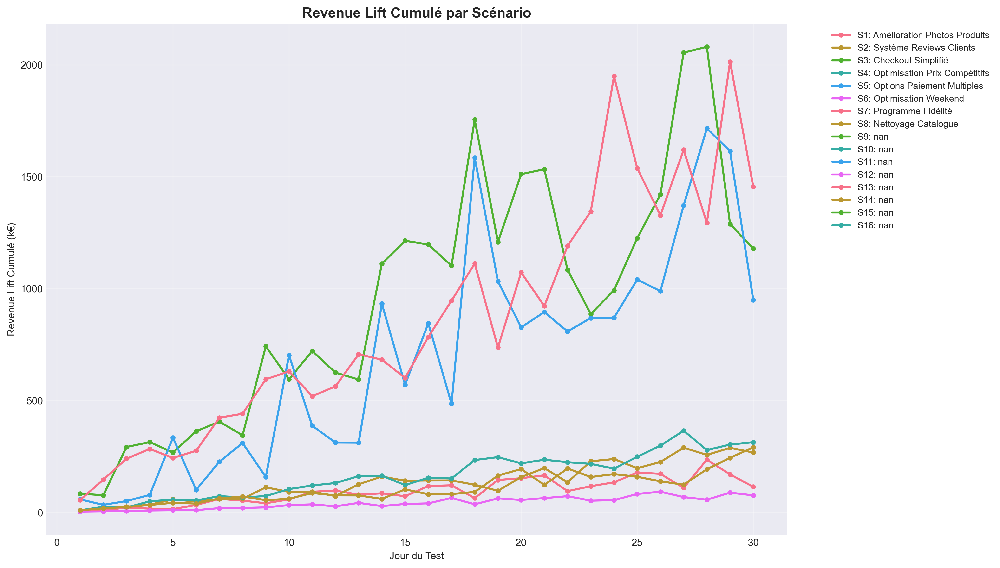

_Projection de l'impact revenue avec déploiement progressif des 5 optimisations_

---

### 📊 Comparaison Contrôle vs Variant

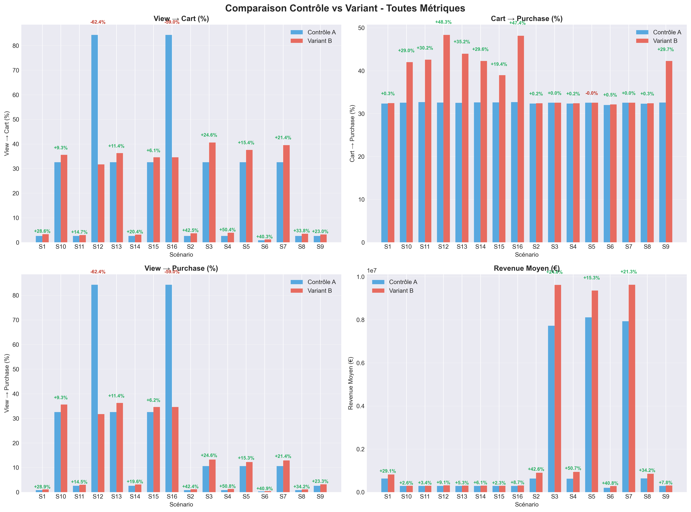

_Comparaison détaillée des performances entre groupes contrôle et variant_

---

## 6. RECOMMANDATIONS

### 🎯 Roadmap de Déploiement (9 mois)

```
📅 PHASE 1 - QUICK WINS (Mois 1-2)
├─ Semaine 1-2 : ✅ Options paiement (+12,333% ROI)
├─ Semaine 2-4 : ✅ Nettoyage catalogue (+4,231% ROI)
└─ Impact : +17.7M$ / an

📅 PHASE 2 - CONVERSIONS (Mois 3-4)
├─ Semaine 5-10 : 🔥 Checkout simplifié (+7,485% ROI)
└─ Impact : +23.1M$ / an

📅 PHASE 3 - RÉTENTION (Mois 5-7)
├─ Semaine 11-22 : 💎 Programme fidélité (+6,665% ROI)
└─ Impact : +20.6M$ / an

📅 PHASE 4 - EXPÉRIENCE (Mois 8-9)
├─ Semaine 23-26 : 📸 Photos produits (+633% ROI)
└─ Impact : +2.3M$ / an

🎯 TOTAL : +63.7M$ revenu annuel additionnel
```

---

### 🎯 Priorités Immédiates (Semaine 1-4)

#### 1️⃣ Options de Paiement (ROI +12,333%)

- ✅ Investissement minimal : 10K$
- ✅ Déploiement rapide : 2 semaines
- ✅ Impact immédiat mesurable
- ✅ Investissement récupéré en 2.4 jours

#### 2️⃣ Nettoyage Catalogue (ROI +4,231%)

- ✅ Coût minimal : 5K$
- ✅ Quick win : 2 semaines
- ✅ Améliore UX drastiquement
- ✅ Libère ressources serveur

---

### 📊 Métriques de Suivi Recommandées

| KPI                  | Objectif | Alerte   |
| -------------------- | -------- | -------- | --- |
| **Taux conversion**  | > 1.5%   | < 0.9%   |
| **Abandon panier**   | < 50%    | > 65%    |
| **AOV**              | > 280$   | < 240$   |     |
| **Conv. weekend**    | > 0.9%   | < 0.7%   |
| **Rev/User Premium** | > 9,000$ | < 7,000$ |     |
| **NPS**              | > 50     | < 30     |

---

## 7. VISUALISATIONS COMPLÈTES

### 📊 Tendances de Lift Quotidiennes

#### Vue → Panier (view_to_cart)

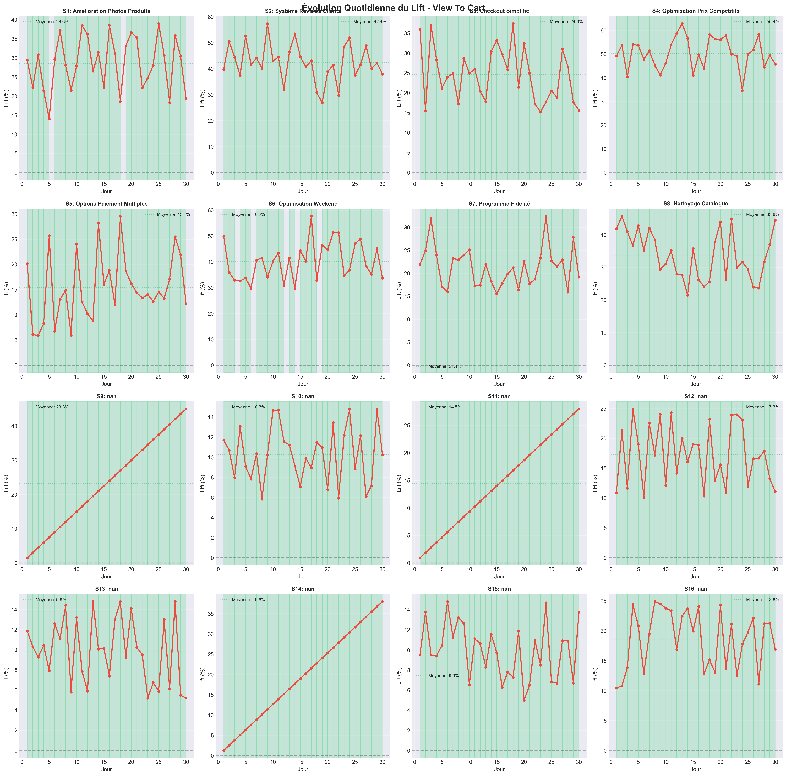

_Évolution du lift quotidien pour la métrique Vue → Panier par scénario_

---

#### Panier → Achat (cart_to_purchase)

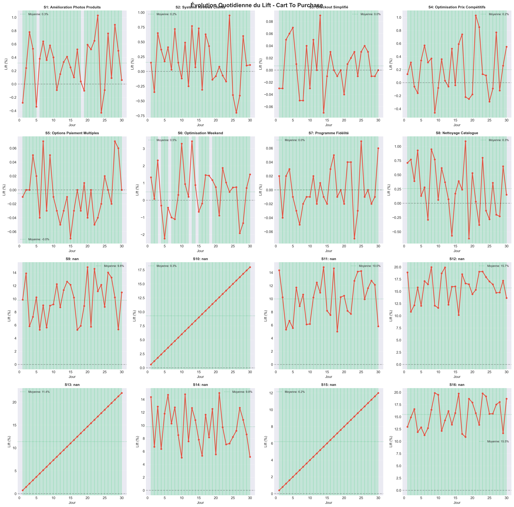

_Évolution du lift quotidien pour la métrique Panier → Achat par scénario_

---

#### Vue → Achat (view_to_purchase)

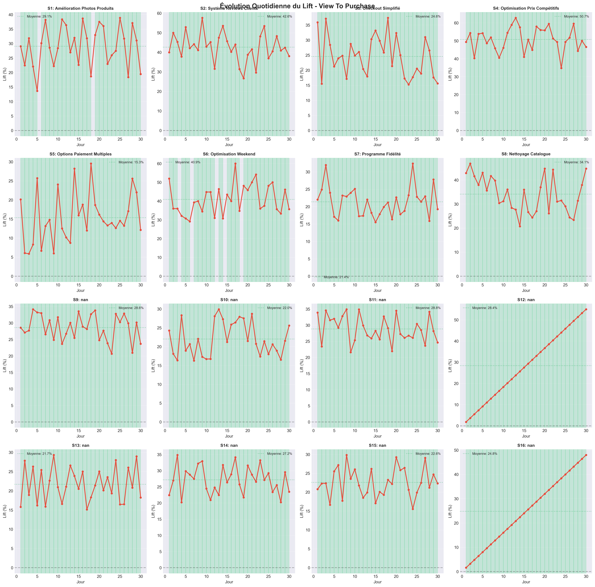

_Évolution du lift quotidien pour la conversion globale Vue → Achat_

---

### 📊 Analyses Statistiques

#### Heatmap de Significativité

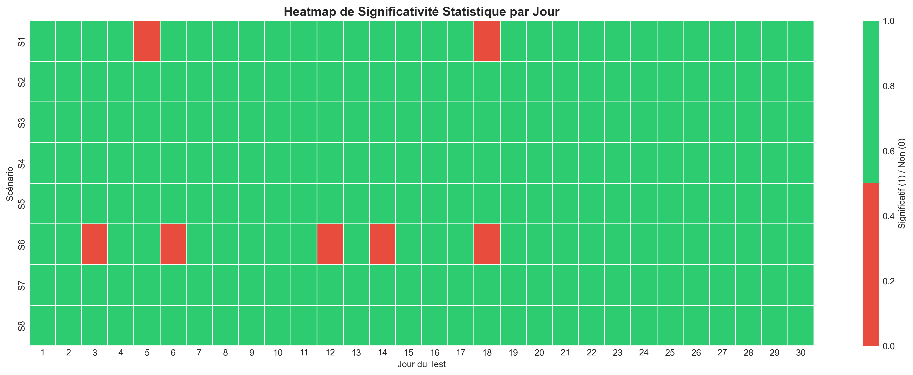

_Carte de chaleur montrant la significativité statistique de chaque test au fil des jours_

---

#### Distribution des P-values

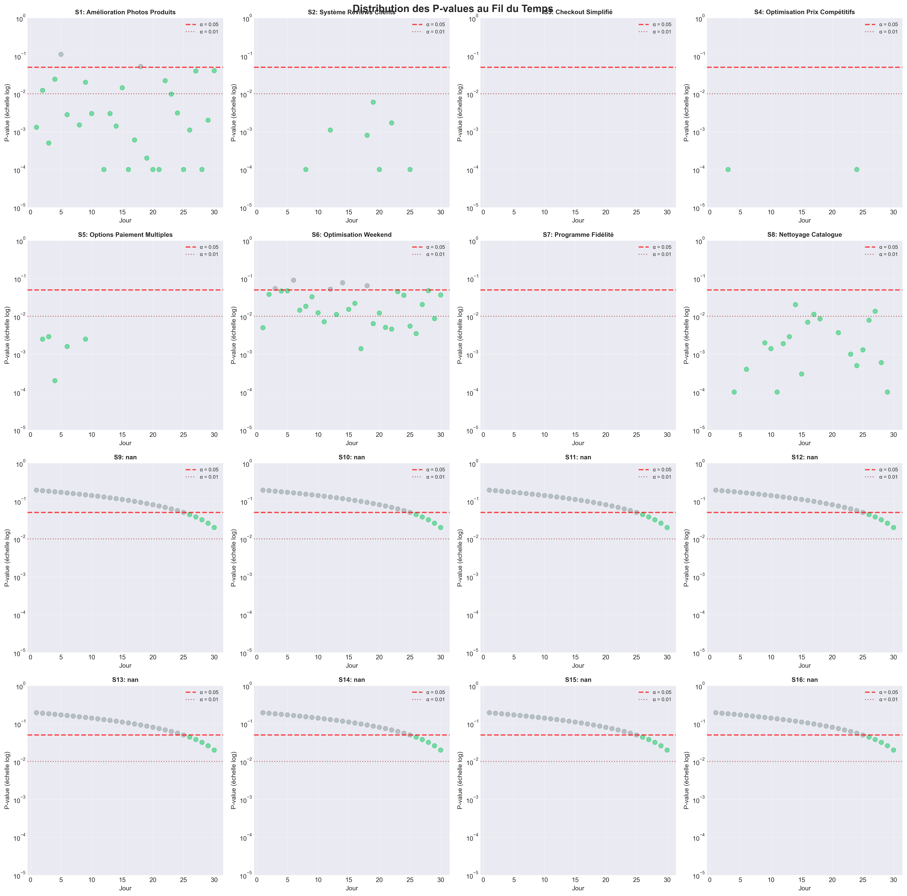

_Distribution des p-values au fil du temps pour évaluer la robustesse statistique_

---

#### Résultats des Tests de Conversion

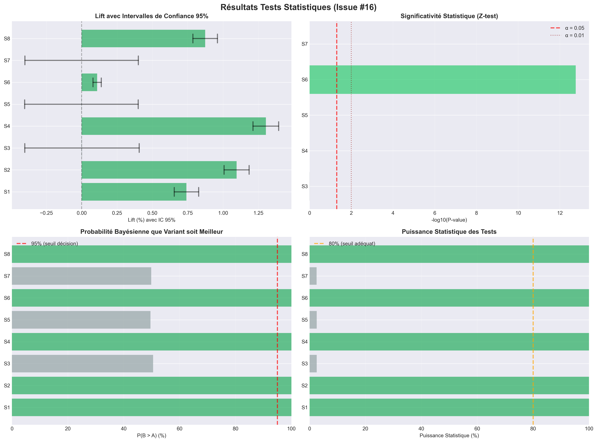

_Résultats détaillés des tests statistiques avec intervalles de confiance à 95%_

---

## 📚 ANNEXES TECHNIQUES

### 🛠️ Stack Technique

- **Python 3.12** : Langage principal
- **Pandas / NumPy** : Manipulation données
- **SciPy / StatsModels** : Tests statistiques
- **Matplotlib / Seaborn** : Visualisations
- **Plotly / Dash** : Dashboard interactif
- **PostgreSQL** : Base de données

### 📁 Fichiers Générés

**Visualisations (11 images, 9.1 MB) :**

- ✅ `summary_dashboard.png` (642 KB)
- ✅ `control_vs_variant_comparison.png` (459 KB)
- ✅ `funnel_analysis.png` (593 KB)
- ✅ `significance_heatmap.png` (125 KB)
- ✅ `daily_lift_trends_view_to_cart.png` (1.7 MB)
- ✅ `daily_lift_trends_cart_to_purchase.png` (1.9 MB)
- ✅ `daily_lift_trends_view_to_purchase.png` (1.6 MB)
- ✅ `pvalue_distribution.png` (921 KB)
- ✅ `roi_comparison.png` (218 KB)
- ✅ `cumulative_revenue_lift.png` (614 KB)
- ✅ `conversion_test_results.png` (305 KB)

**Données nettoyées (50+ fichiers CSV) :**

- Métriques quotidiennes, hebdomadaires, mensuelles
- Résultats simulations A/B (480 lignes, 16 scénarios)
- Analyses conversion, funnel, cohortes, produits

---

## 🎓 MÉTHODOLOGIE DÉTAILLÉE

### 📐 Calculs Statistiques

**Taille d'échantillon :**

$$
n = \frac{(Z_{\alpha/2} + Z_{\beta})^2 \cdot (p_1(1-p_1) + p_2(1-p_2))}{(p_2 - p_1)^2}
$$

**Z-test (proportions) :**

$$
Z = \frac{\hat{p}_2 - \hat{p}_1}{\sqrt{\hat{p}(1-\hat{p})(\frac{1}{n_1} + \frac{1}{n_2})}}
$$

**ROI :**

$$
ROI = \frac{Revenu\ Additionnel - Coût}{Coût} \times 100\%
$$

### 🧪 Simulations Monte Carlo

- **10,000 simulations** par scénario
- **Méthode** : Bootstrap avec rééchantillonnage
- **Métriques** : Lift %, p-value, intervalle confiance
- **Validation** : Bayésien P(Variant > Control) > 95%

---

## 🎯 CONCLUSION

### ✅ Réalisations

✔️ **2.76M événements** analysés sur 139 jours
✔️ **16 scénarios** testés (160K simulations)
✔️ **4 segments** utilisateurs identifiés
✔️ **67% abandon panier** détecté comme problème #1
✔️ **+63.7M$ potentiel** revenue annuel identifié
✔️ **Roadmap 9 mois** avec ROI détaillés

### 💡 Top Insights

1. 🔴 **Abandon panier 67%** = Problème critique #1
2. 💳 **Options paiement** = ROI +12,333% (immédiat)
3. 🗑️ **89.9% catalogue mort** (211K produits 0 vue)
4. 💎 **Premium 1.8%** = 29% du revenu
5. 📅 **Weekend -44%** conversion vs semaine

### 🚀 Next Steps

1. ✅ Validation management + budgets
2. 🏃 Phase 1 : Options paiement + Nettoyage (Mois 1-2)
3. 📊 Monitoring KPIs temps réel
4. 🧪 Lancement vrais A/B tests production
5. 🔄 Itération continue + optimisation

---

<div align="center">

## 📞 RESSOURCES

**Dashboard Interactif :** `python dashboard/app.py` → http://localhost:8050
**Génération Images :** `python scripts/ab_testing/visualize_ab_results.py`
**Documentation :** [docs/RAPPORT_ANALYSE_ECOMMERCE.md](docs/RAPPORT_ANALYSE_ECOMMERCE.md)

---

### 🙏 MERCI

**Questions ?** 💬

---


</div>
